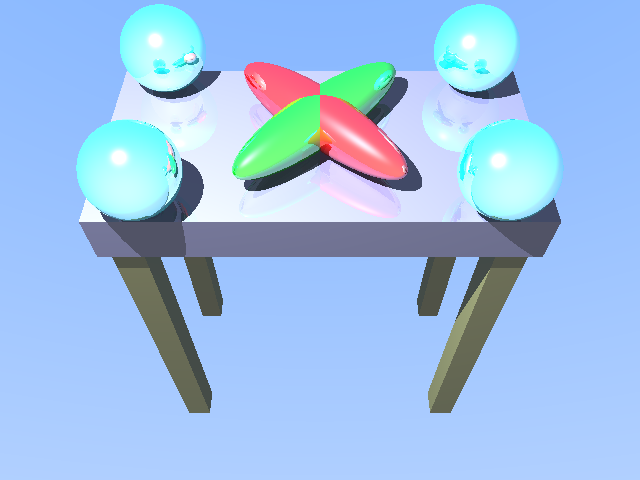
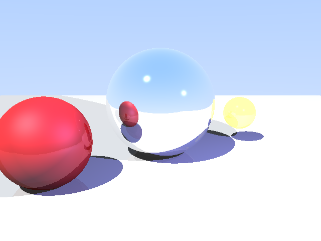

# CS-167 Computer Graphics - Homework 3: Ray Tracing

This repository contains the solution for Homework 3 of the CS-167 Computer Graphics online course by Professor Ravi Ramamurthi. The course delves into fundamental concepts of computer graphics, from rendering techniques to geometric modeling.

Homework 3 focused on implementing a basic ray tracer from scratch in C++. The goal was to render 3D scenes by simulating light rays, including features like basic geometry (spheres, triangles), transformations, lighting models (ambient, diffuse, specular), shadows, and recursive reflections.

---

### Rendered Scene Examples

Here are some example images rendered by the ray tracer:

#### `scene3_lit.png`
A table scene showcasing transformations, multiple objects, and shadows cast by a point light.

#### `scene4.png`
A complex scene demonstrating various material properties, reflections, and mixed light sources.

