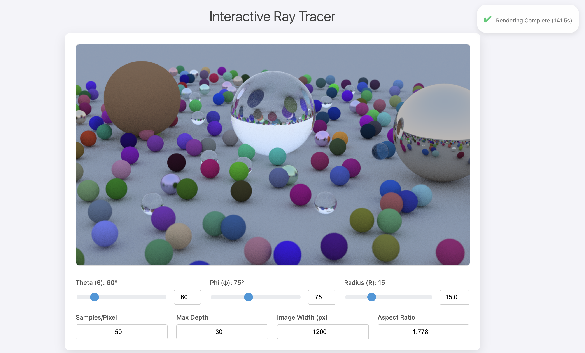

# Interactive Ray Tracer

This repository hosts an interactive web-based ray tracer, primarily developed as a learning project following the principles from the "Ray Tracing in One Weekend" book series by Peter Shirley et al. It provides a real-time, progressive rendering experience directly in your browser, allowing for dynamic camera control and rendering parameter adjustments.

The goal of this project is to build a foundational understanding of ray tracing techniques and to explore interactive visualization of computer graphics concepts.

## Features



*   **Progressive Rendering:** Witness your ray-traced images refine in real-time as samples accumulate, providing immediate visual feedback for complex scenes.
*   **Radial Camera Control:** Manipulate the camera's position using intuitive spherical coordinates (Theta, Phi, Radius) through sliders and direct input.
*   **Configurable Rendering Parameters:** Adjust key rendering settings directly from the web interface, including:
    *   Samples Per Pixel
    *   Maximum Ray Depth
    *   Image Width
    *   Aspect Ratio
*   **Detailed Status Display:** Monitor rendering progress with live sample counts, estimated time remaining, and completion notifications.
*   **Dynamic Scene:** Features a complex scene with diffuse, metallic, and dielectric (glass) spheres, demonstrating various material interactions and depth of field.

## How to Run

To get the interactive ray tracer up and running on your local machine:

1.  **Navigate to the `web_app` directory:**
    ```bash
    cd "My codes/web_app"
    ```

2.  **Compile the C++ Ray Tracer:**
    This command compiles the core ray tracing engine (`hosting_main.cc`). It uses headers copied from the `book_code` directory into `book_headers` for a self-contained web app environment.
    ```bash
    g++ -std=c++11 -O2 -Ibook_headers hosting_main.cc -o hosting_executable
    ```

3.  **Start the Flask Web Server:**
    This will launch the Python Flask server, which orchestrates the web interface and interacts with the C++ rendering engine.
    ```bash
    python server.py
    ```
    The server will start on `http://127.0.0.1:5001/`.

4.  **Access the Application:**
    Open your web browser and go to `http://127.0.0.1:5001/`. You should see the interactive ray tracer application.


## Future Plans

This repository is envisioned as a comprehensive learning resource for computer graphics. Future additions will include:

*   Implementations from "Ray Tracing: The Next Week" and "Ray Tracing: The Rest of Your Life" book series.
*   General OpenGL graphics code and experiments.
*   Personal notes and insights on graphics programming topics.

## Credits

This project is inspired by and heavily based on the excellent "Ray Tracing in One Weekend" book series by Peter Shirley, Trevor David Black, and Steve Hollasch.

---
